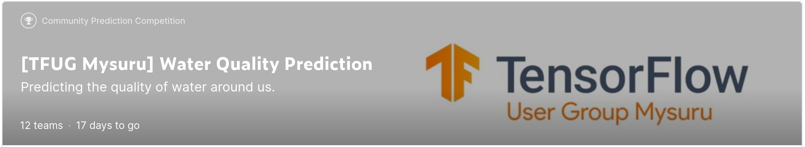

# -TFUG-Mysuru-Water-Quality-Prediction
In this competition, our aim is to train a machine learning model based on the water quality data provided to you in the training file and further predict the quality estimation result for the test dataset.
 

